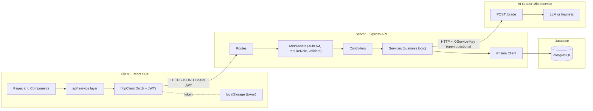
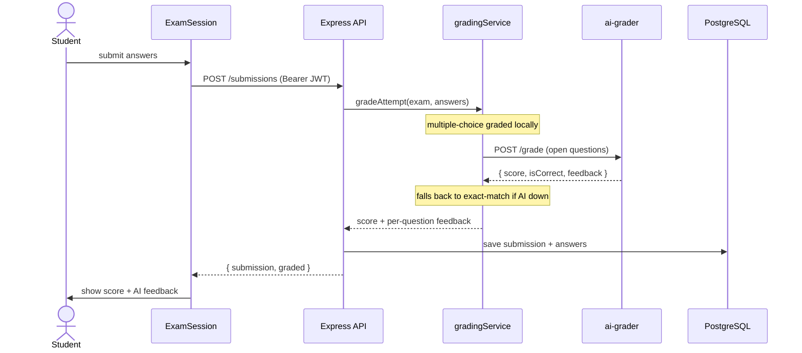
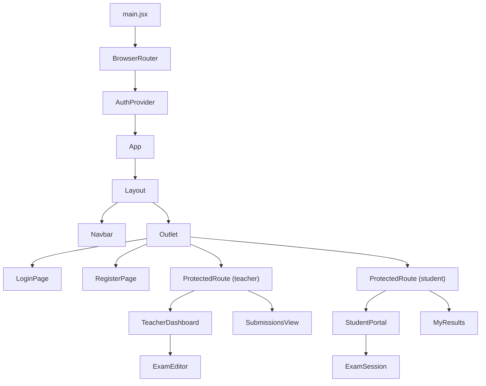
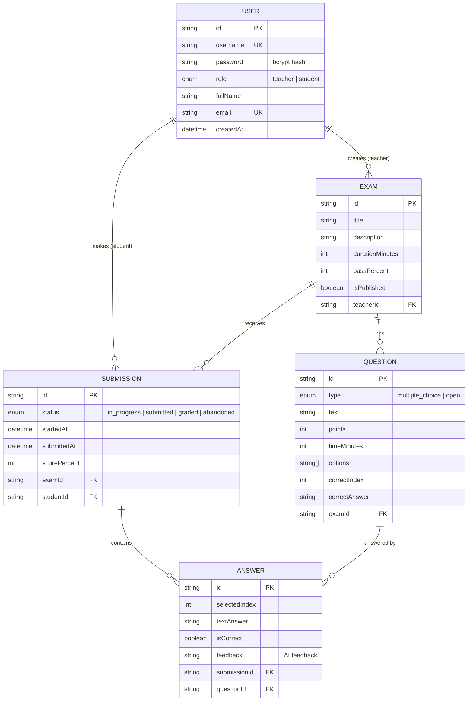
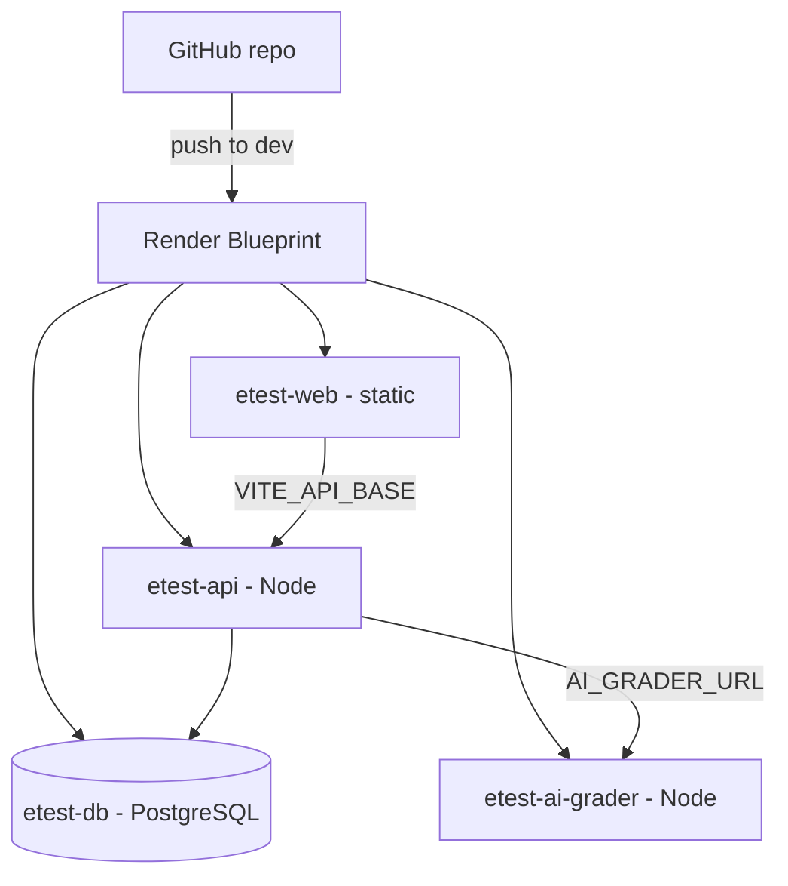

# E-Test System — Full Stack Exam Management

A full-stack web application for managing online exams and student submissions.
Lecturers create, manage, publish, and review exams; students take exams and get
auto-graded results — including **AI grading of open-ended answers** via a
dedicated microservice.

- **Frontend:** React 19 + Vite + React Router + Bootstrap
- **Backend:** Node.js + Express (layered / MVC) + JWT auth
- **Database:** PostgreSQL via Prisma ORM
- **Microservice:** standalone AI grading service for open-ended answers
- **DevOps:** Docker + Docker Compose, GitHub Actions CI, Render deployment

## Links

- **Repository:** https://github.com/nronen29/React-fullstack-project
- **Live frontend:** https://etest-web.onrender.com
- **Live API:** https://etest-api.onrender.com (`/api/health` for a health check)
- **AI grader:** https://etest-ai-grader.onrender.com (`/health`)

> Hosted on Render's free tier — services sleep when idle, so the first request
> after a while can take ~50 seconds to wake up.

## Table of contents

- [Features](#features)
- [Tech stack](#tech-stack)
- [Architecture](#architecture)
- [Data flow](#data-flow)
- [Frontend component hierarchy](#frontend-component-hierarchy)
- [Database model (ERD)](#database-model-erd)
- [API surface](#api-surface)
- [AI grading microservice](#ai-grading-microservice)
- [Repository structure](#repository-structure)
- [Getting started](#getting-started)
- [Environment variables](#environment-variables)
- [Demo accounts](#demo-accounts)
- [Testing](#testing)
- [Deployment (Render)](#deployment-render)
- [Documentation](#documentation)

## Features

### Lecturer (teacher)
- Login with JWT-based authentication
- Create / edit / delete exams
- Add multiple-choice and open questions, set points and per-question time
- Publish exams to make them visible to students
- Review submissions per exam and see analytics (average, min, max, pass rate)

### Student
- Register and login
- Enter and take a published exam with a live countdown timer
- Auto-save answers in the session; server-side auto-grading on submit
- View personal results, pass/fail status, and AI feedback on written answers

### Engineering
- Clean layered architecture (routes → controllers → services → Prisma)
- Role-based authorization; correct answers never sent to students
- Request validation (zod), central error handling, structured logging (winston / morgan)
- Unit tests (Jest + Vitest), GitHub Actions CI, fully containerized with Docker
- **Microservice**: AI grading service scores open-ended answers over HTTP
  (LLM when an API key is set, keyword heuristic otherwise), with graceful
  fallback to local grading

## Tech stack

| Layer | Technology |
|-------|-----------|
| Frontend | React 19, Vite, React Router, Bootstrap 5 |
| Backend | Node.js, Express, Prisma ORM |
| Database | PostgreSQL |
| Auth | JWT (jsonwebtoken), bcrypt password hashing |
| Validation / logging | zod, winston, morgan |
| Microservice | Express (AI grader), optional OpenAI-compatible LLM |
| Testing | Jest + Supertest (server), Vitest (client) |
| DevOps | Docker, Docker Compose, GitHub Actions, Render |

## Architecture

Three-tier application (client / server / database) plus a grading microservice.



Who stores what:

| Concern | Where it lives |
|---------|----------------|
| Logged-in user + JWT | Client `localStorage` |
| Authentication / authorization | Server middleware (JWT + roles) |
| Business rules (grading, validation, ownership) | Server services (authoritative) |
| Persistent data (users, exams, questions, submissions, answers) | PostgreSQL via Prisma |
| Open-answer grading | AI grader microservice (with server fallback) |
| Passwords | PostgreSQL, bcrypt-hashed (never sent to client) |

## Data flow



## Frontend component hierarchy



## Database model (ERD)



## API surface

Base path: `/api`. All data routes require a JWT (`Authorization: Bearer <token>`).

| Method | Path | Auth | Description |
|--------|------|------|-------------|
| POST | `/auth/register` | public | Register a student → `{ token, user }` |
| POST | `/auth/login` | public | Login → `{ token, user }` |
| GET | `/auth/me` | any | Current user from token |
| GET | `/exams` | any | Published exams (answers stripped) |
| GET | `/exams/mine` | teacher | The teacher's own exams |
| GET | `/exams/:id` | any | One exam (answers hidden from students) |
| GET | `/exams/:id/stats` | teacher | Aggregate stats for the exam |
| POST | `/exams` | teacher | Create exam + questions |
| PUT | `/exams/:id` | teacher (owner) | Update exam + questions |
| DELETE | `/exams/:id` | teacher (owner) | Delete exam |
| POST | `/submissions` | student | Submit attempt (graded server-side) |
| GET | `/submissions/mine` | student | The student's own results |
| GET | `/submissions?examId=` | teacher (owner) | Submissions for an exam |
| GET | `/health` | public | Health check |

## AI grading microservice

`services/ai-grader/` is an independently deployable Express service whose only
job is to grade one open-ended answer.

- **Endpoint:** `POST /grade` with `{ questionText, expectedAnswer, studentAnswer, maxPoints }` → `{ score, isCorrect, feedback, provider }`
- **Two modes:** uses an OpenAI-compatible **LLM** when `AI_API_KEY` is set;
  otherwise a keyword-overlap **heuristic** that runs offline. Check the mode at `/health`.
- **Resilience:** the main API attaches a shared secret (`X-Service-Key`) and
  gracefully falls back to local exact-match grading if the service is disabled
  or unreachable — so submissions never fail.
- **Why separate:** grading logic (and any future model/provider swap or scaling)
  is isolated from the core API; a failure there cannot break exam CRUD or auth.

## Repository structure

```
.
├── client/                 # React SPA (Vite)
│   └── src/
│       ├── api/            # data access (exam/submission/user services)
│       ├── services/       # config, httpClient, storage
│       ├── auth/           # AuthContext, ProtectedRoute, Login/Register
│       └── components/     # layout, teacher, student
├── server/                 # Express API + Prisma
│   ├── src/
│   │   ├── config/ models/ middleware/ validators/
│   │   ├── services/ controllers/ routes/ utils/
│   │   └── app.js server.js
│   └── prisma/             # schema, migrations, seed
├── services/
│   └── ai-grader/          # AI grading microservice
├── docs/                   # architecture, ERD, UML, sequence diagrams, milestones
├── docker-compose.yml      # db + api + ai-grader + web
├── render.yaml             # Render deployment blueprint
└── .github/workflows/ci.yml
```

## Getting started

### Option A — Docker (recommended, runs everything)

```bash
docker compose up --build
```

| Service | URL |
|---------|-----|
| Frontend | http://localhost:8081 |
| API | http://localhost:4000/api |
| AI grader | http://localhost:4100 |
| PostgreSQL | localhost:5432 |

Demo data is seeded automatically (`SEED_ON_START=true`).

### Option B — Local dev

```bash
# 1. Database
docker compose up -d db

# 2. Backend
cd server
cp .env.example .env          # set DATABASE_URL, JWT_SECRET
npm install
npx prisma migrate dev        # create + apply schema
npm run seed                  # load demo data
npm run dev                   # http://localhost:4000

# 3. AI grader (new terminal)
cd services/ai-grader
npm install
npm run dev                   # http://localhost:4100

# 4. Frontend (new terminal)
cd client
npm install
npm run dev                   # http://localhost:5173
```

## Environment variables

| Service | Variable | Purpose |
|---------|----------|---------|
| server | `DATABASE_URL` | PostgreSQL connection string |
| server | `JWT_SECRET`, `JWT_EXPIRES_IN` | Token signing |
| server | `CORS_ORIGIN` | Allowed frontend origin(s) |
| server | `AI_GRADER_URL`, `AI_GRADER_KEY` | AI grader location + shared secret |
| server | `SEED_ON_START`, `AUTO_SEED` | Demo seeding controls |
| server | `PORT`, `NODE_ENV`, `LOG_LEVEL`, `BCRYPT_ROUNDS` | Runtime tuning |
| ai-grader | `SERVICE_KEY` | Shared secret (must match `AI_GRADER_KEY`) |
| ai-grader | `AI_API_KEY`, `AI_BASE_URL`, `AI_MODEL` | Enable a real LLM (optional) |
| client | `VITE_API_BASE` | Backend API URL (baked in at build) |

See [`server/.env.example`](server/.env.example), [`services/ai-grader/.env.example`](services/ai-grader/.env.example),
and [`client/.env.example`](client/.env.example).

## Demo accounts

| Username | Password | Role |
|----------|----------|------|
| `drsmith` | `teacher123` | teacher |
| `alex` | `student123` | student |
| `jordan` | `student123` | student |
| `sam` | `student123` | student |

## Testing

```bash
cd server            && npm test   # Jest: grading, id helpers, API smoke tests
cd services/ai-grader && npm test   # Jest: heuristic grader + /grade endpoint
cd client            && npm test   # Vitest: pure helpers
```

CI (`.github/workflows/ci.yml`) runs client lint + test + build, server tests,
ai-grader tests, and builds all three Docker images on every push / PR.

## Deployment (Render)

The [`render.yaml`](render.yaml) blueprint provisions four resources: a managed
PostgreSQL database, the Node API, the AI grader, and the static React site.



After the first deploy, set the cross-service values (URLs are generated per service):

| Service | Variable | Value |
|---------|----------|-------|
| etest-web | `VITE_API_BASE` | `https://etest-api.onrender.com/api` |
| etest-api | `CORS_ORIGIN` | `https://etest-web.onrender.com` |
| etest-api | `AI_GRADER_URL` | `https://etest-ai-grader.onrender.com` |

Redeploy `etest-web` with **Clear build cache & deploy** after changing
`VITE_API_BASE` (it is baked in at build time). The API runs
`prisma migrate deploy` on start and auto-seeds demo data on first boot.

## Documentation

- [Architecture](docs/architecture.md) — system overview, client/server design, API surface
- [Database](docs/database.md) — ERD + JSON models
- [UML](docs/uml.md) — OOP class diagrams
- [Sequence diagrams](docs/sequence-diagrams.md) — login, create exam, take exam, AI grading
- [Milestones & workflows](docs/milestones.md) — branches, CI, Docker, deploy
