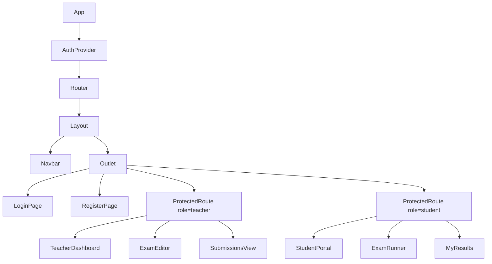
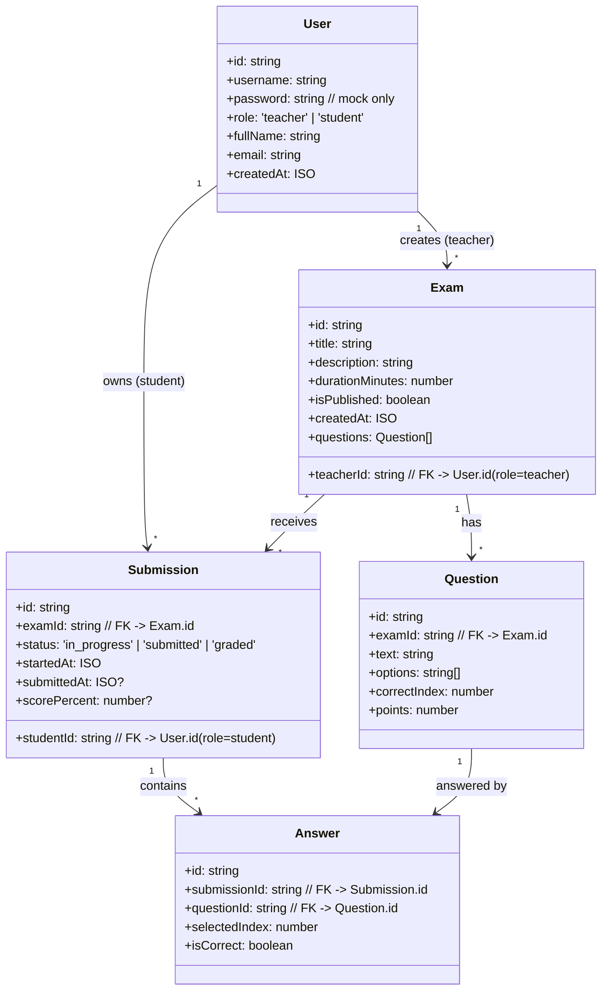
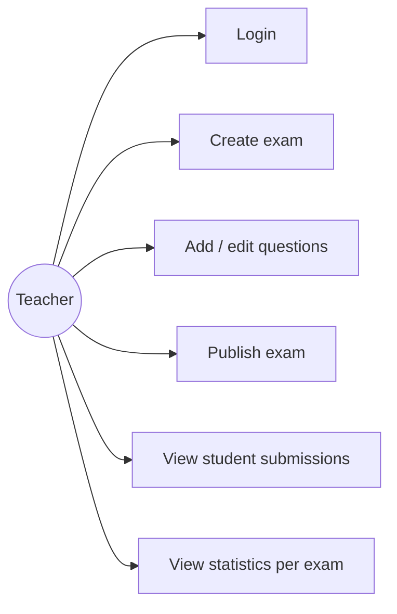
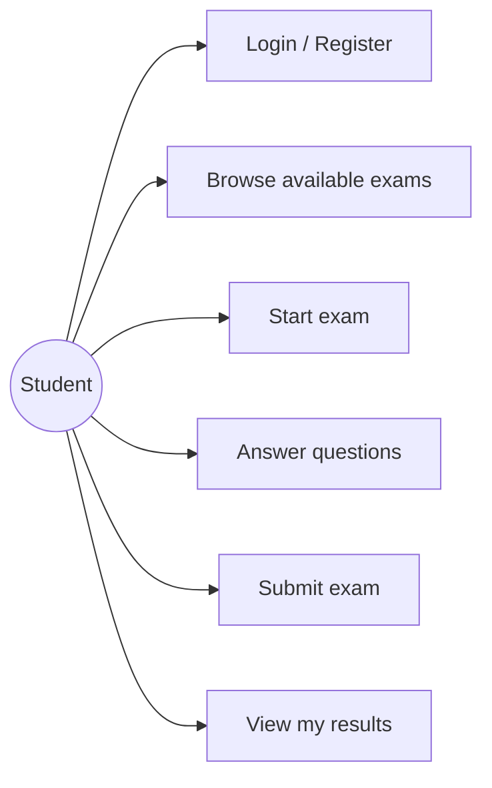

# TASK_PLAN.md — E-Test System

> Detailed work plan for the project: online exam system (Vite + React).
> We work **in small steps**; each step = one atomic change suitable for its own commit.

---

## 1. Current state

```
client/
  src/
    api/
      examService.js   # async getAllExams / getExamById / createExam
      mockDb.js        # exams (with embedded questions) + legacy studentScores
    assets/
    utils/
    App.css
    App.jsx            # role toggle: teacher | student (no real auth)
    index.css
    main.jsx
    StudentPortal.jsx  # enter exam id, view questions (no answer submission)
    TeacherDashboard.jsx # list exams
```

What exists today:
- No real authentication — only a Teacher/Student toggle in `App.jsx`.
- The mock DB only holds `exams` and a legacy `studentScores` field that nothing uses.
- No separation into services (Logger / Storage / Notify / Config).
- No router — all screens live in one file.
- No student answer persistence (submissions / answers).

---

## 2. Target structure

```
client/
  src/
    api/                      # data access layer (mock until backend exists)
      mockDb.js               # mock data: users, exams, questions, submissions, answers
      examService.js          # CRUD for exams + questions
      userService.js          # login / register / users
      submissionService.js    # start exam, save answers, scoring
    services/                 # cross-app services (singletons)
      logger.js               # console + level (info/warn/error)
      storage.js              # localStorage wrapper with try/catch + JSON
      notify.js               # UI messages (toast / alert)
      config.js               # config: API_BASE, FEATURE_FLAGS, etc.
    auth/
      AuthContext.jsx         # global state for logged-in user
      LoginPage.jsx
      RegisterPage.jsx
      ProtectedRoute.jsx      # role-based protection
    pages/
      teacher/
        TeacherDashboard.jsx
        ExamEditor.jsx        # create / edit exam + questions
        SubmissionsView.jsx   # student submissions
      student/
        StudentPortal.jsx
        ExamRunner.jsx        # exam UI: question-by-question, save answers
        MyResults.jsx         # my grades
    components/
      layout/
        Navbar.jsx            # top menu by role
        Layout.jsx            # shell + Outlet
      common/                 # buttons, fields, cards
    utils/
    App.jsx                   # only <Router /> + <Layout />
    main.jsx
```

---

## 3. Components hierarchy



---

## 4. UML / code structure explanation



**Overall architecture:**

- **`api/`** — data access layer. Every call is async (`await delay()`) to simulate a real server. Swapping to `fetch()` later should be localized.
- **`services/`** — singletons with no React dependency (easy to test with vitest).
- **`auth/`** — Context only (no Redux). Persists the logged-in user via `storage.js`.
- **`pages/`** — full screens wired to routing.
- **`components/`** — reusable UI pieces without global data dependencies.

OOP is used selectively — e.g. a small `Logger` class with levels, or a `Storage` class with namespaces. Most code stays functional.

---

## 5. Services needed

| Service | Responsibility | OOP? |
|---------|----------------|------|
| `logger` | `logger.info/warn/error` with prefix and log level | Yes (small class) |
| `storage` | `get/set/remove` with JSON + try/catch | Optional |
| `notify` | user-visible messages (toast / alert) | No |
| `config` | global constants (API_BASE, MOCK_DELAY_MS, etc.) | No |
| `userService` | login, register, getCurrentUser | No |
| `examService` | exam + question CRUD (exists) | No |
| `submissionService` | startSubmission, saveAnswer, submitExam, score | No |

---

## 6. Mock DB entities (first-step milestone)

Entities in `mockDb.js`:

1. **users** — teachers and students (including mock password for login).
2. **exams** — exam owned by a teacher (`teacherId`).
3. **questions** — embedded in `exam.questions` *for backward compatibility with existing examService*, but each question also has `examId` and `points` to move toward a normalized model.
4. **submissions** — student submission for an exam (status: in_progress / submitted / graded).
5. **answers** — a single answer within a submission.

Relationships: see UML diagram above.

---

## 7. Teacher use cases



- **UC1 Login** — sign in with username + password from mock data.
- **UC2 Create exam** — title, description, duration; auto-linked to logged-in `teacherId`.
- **UC3 Add/edit questions** — multiple choice with `correctIndex` and `points`.
- **UC4 Publish** — `isPublished=true` exposes the exam to students.
- **UC5 View submissions** — list submissions per exam with each student’s score.
- **UC6 Statistics** — average, min, max, pass rate.

---

## 8. Student use cases



- **UC1 Login/Register** — new students can register.
- **UC2 Browse** — only sees `isPublished=true` exams.
- **UC3 Start** — creates a `Submission` with `status='in_progress'`.
- **UC4 Answer** — each choice saved as an `Answer` (autosave).
- **UC5 Submit** — `status='submitted'`, then score computed → `status='graded'`.
- **UC6 My results** — submission history + score.

---

## 9. Step-by-step implementation plan

> Each step = at least one commit. Each step must not break the existing UI.

| # | Step | Files | Status |
|---|------|-------|--------|
| 0 | Work plan | `TASK_PLAN.md` | **this step** |
| 1 | **Extended data layer** — users, submissions, answers | `src/api/mockDb.js` | **next step** |
| 2 | `userService` — `login`, `register`, `getById` | `src/api/userService.js` | |
| 3 | Base services: `logger`, `storage`, `notify`, `config` | `src/services/*` | |
| 4 | `AuthContext` + `LoginPage` + `RegisterPage` | `src/auth/*` | |
| 5 | Routing (`react-router`) + `Layout` + `Navbar` | `src/components/layout/*`, `App.jsx` | |
| 6 | Split `pages/teacher/` and `pages/student/` and move existing screens | `src/pages/**` | |
| 7 | `ExamEditor` — create and edit exam + questions | `src/pages/teacher/ExamEditor.jsx` | |
| 8 | `submissionService` + `ExamRunner` (answer autosave) | `src/api/submissionService.js`, `src/pages/student/ExamRunner.jsx` | |
| 9 | `SubmissionsView` for teacher + `MyResults` for student | `src/pages/teacher/SubmissionsView.jsx`, `src/pages/student/MyResults.jsx` | |
| 10 | Unit tests for services (vitest) | `src/**/*.test.js` | |

---

## 10. Naming & Git conventions

- Branches: `feature/<short-topic>` (e.g. `feature/mockdb-entities`).
- Commit messages:
  - `feat(scope): ...` new feature
  - `refactor(scope): ...` structural change without behavior change
  - `docs: ...` documentation
  - `test: ...` tests
- Each PR is small, focused, with a short “what and why” description.

-create github pages 
