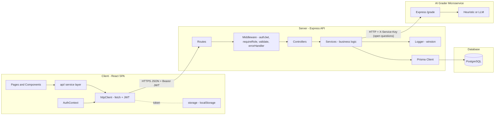
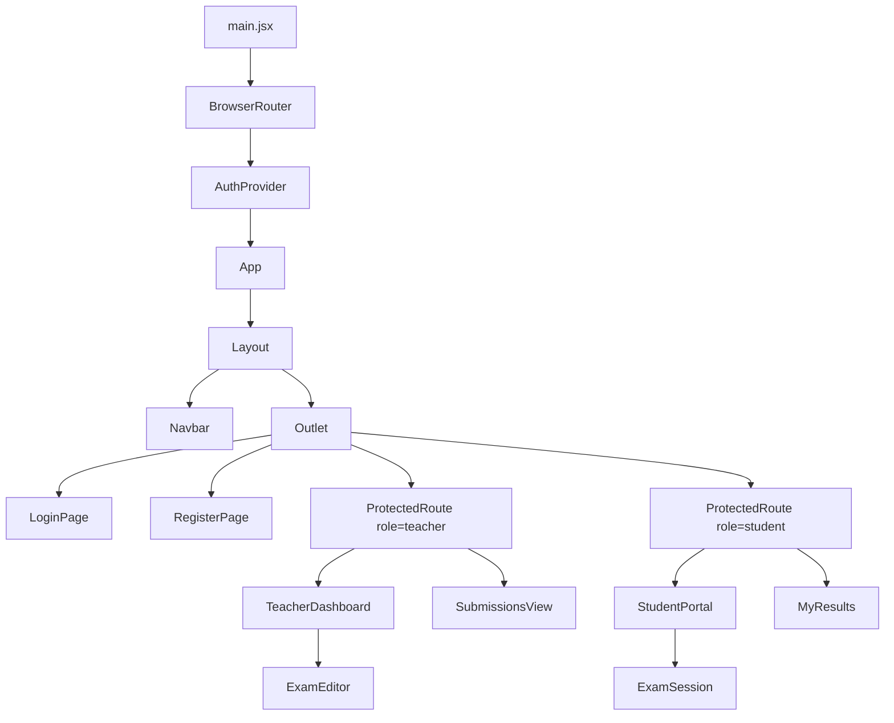

# Architecture

## 1. System overview (Client / Server / DB / Services)

The E-Test System is a classic three-tier web application plus cross-cutting
services.



The system is a monolith API plus one **microservice**: the AI grader is an
independently deployable Express service that scores open-ended answers. The
main API calls it over HTTP only for open questions, retries once with a longer
timeout to absorb cold starts, and falls back to local keyword-overlap grading
if it is disabled or unreachable.

### Who talks to whom / who stores what

| Concern | Where it lives | Notes |
|---------|----------------|-------|
| UI state, current route | Client (React) | Ephemeral, in memory |
| Logged-in user + JWT | Client `localStorage` (`etest_currentUser`, `etest_authToken`) | Token attached as `Authorization: Bearer` on every request |
| Authentication / authorization | Server middleware | JWT verified per request; roles enforced |
| Business rules (grading, validation, ownership) | Server services | Authoritative; the client never grades |
| Persistent data (users, exams, questions, submissions, answers) | PostgreSQL via Prisma | Single source of truth |
| Passwords | PostgreSQL, **bcrypt-hashed** | Never returned to the client |

### How data flows

1. The React app calls a function in `client/src/api/*` (e.g. `getExamById`).
2. That function uses `httpClient` which adds the JWT and calls the Express API.
3. Express runs middleware (auth -> role -> validation), then the controller.
4. The controller delegates to a service, which uses Prisma to read/write PostgreSQL.
5. The service returns plain objects; the controller responds with JSON.
6. The client updates React state and re-renders.

## 2. Client architecture

- Pattern: component-based SPA with a thin **service layer** (`api/`) separating
  data access from UI, and **cross-cutting services** (`services/`).
- Routing: `react-router-dom` with role-based `ProtectedRoute`.
- State: React hooks + a single `AuthContext` (no Redux needed).

### Client packages

| Package | Purpose |
|---------|---------|
| `react`, `react-dom` | UI runtime |
| `react-router-dom` | Client-side routing |
| `bootstrap` | Styling / responsive layout |
| `vite`, `@vitejs/plugin-react` | Dev server + build (dev) |
| `vitest` | Unit testing (dev) |
| `eslint` + plugins | Linting (dev) |

### Component hierarchy



### Client folder layout

```
client/src/
  api/            # data access (examService, submissionService, userService)
  services/       # config, httpClient, storage (OOP class)
  auth/           # AuthContext, useAuth, ProtectedRoute, Login/Register pages
  components/
    layout/       # Navbar, Layout
    teacher/      # ExamEditor, SubmissionsView
    student/      # ExamSession, MyResults
  App.jsx         # routes
  main.jsx        # bootstrap (Router + AuthProvider)
```

## 3. Server architecture (layered / MVC-style)

Request path: **Route -> Middleware -> Controller -> Service -> Prisma -> DB**.
Controllers stay thin (HTTP only); services hold business logic; Prisma is the
data layer.

### Server packages

| Package | Purpose |
|---------|---------|
| `express` | HTTP framework / routing |
| `@prisma/client` + `prisma` | ORM + schema/migrations |
| `jsonwebtoken` | JWT sign/verify |
| `bcryptjs` | Password hashing |
| `zod` | Request validation schemas |
| `cors` | Cross-origin access for the SPA |
| `morgan` | HTTP request logging |
| `winston` | Application logger |
| `dotenv` | Env configuration |
| `jest`, `supertest` | Testing (dev) |

### Server folder layout

```
server/src/
  config/         # env loading + typed config
  models/         # Prisma client singleton
  middleware/     # auth (JWT + roles), validate, errorHandler
  validators/     # zod schemas
  services/       # authService, examService, submissionService (business logic)
  controllers/    # request handlers
  routes/         # express routers (auth, exams, submissions)
  utils/          # logger, ApiError, asyncHandler, ids, grading
  app.js          # app assembly (middleware + routes)
  server.js       # process entry (listen + graceful shutdown)
prisma/
  schema.prisma   # data model
  seed.js         # demo data (ported from the old mock DB)
```

## 3b. AI grading microservice (`services/ai-grader/`)

A small, standalone Express service with a single responsibility: grade one
open-ended answer.

- Endpoint: `POST /grade` with `{ questionText, expectedAnswer, studentAnswer, maxPoints }` -> `{ score, isCorrect, feedback, provider }`.
- Auth: optional shared secret via the `X-Service-Key` header.
- Two modes: uses an OpenAI-compatible **LLM** when `AI_API_KEY` is set; otherwise a keyword-overlap **heuristic** (works offline). The main API also degrades gracefully to its own local keyword-overlap scorer if the service is down.
- Deployed as its own container (`docker-compose`) and its own Render service, demonstrating a microservice boundary and inter-service communication.

Why a separate service: grading logic (and any future model/provider swap or
scaling) is isolated from the core API; a failure or slowdown there cannot break
exam CRUD or auth.

## 4. API surface

| Method | Path | Auth | Description |
|--------|------|------|-------------|
| POST | `/api/auth/register` | public | Register a student, returns `{ token, user }` |
| POST | `/api/auth/login` | public | Login, returns `{ token, user }` |
| GET | `/api/auth/me` | any | Current user from token |
| GET | `/api/exams` | any | Published exams (answers stripped) |
| GET | `/api/exams/mine` | teacher | The teacher's own exams |
| GET | `/api/exams/:id` | any | One exam (answers hidden from students) |
| GET | `/api/exams/:id/stats` | teacher | Aggregate stats for the exam |
| POST | `/api/exams` | teacher | Create exam + questions |
| PUT | `/api/exams/:id` | teacher (owner) | Update exam + questions |
| DELETE | `/api/exams/:id` | teacher (owner) | Delete exam |
| POST | `/api/submissions` | student | Submit attempt (graded server-side) |
| GET | `/api/submissions/mine` | student | The student's own results |
| GET | `/api/submissions?examId=` | teacher (owner) | Submissions for an exam |
| GET | `/api/health` | public | Health check |

## 5. Security notes

- Passwords hashed with bcrypt; only public user fields ever leave the server.
- JWT required on all data routes; role checks via `requireRole`.
- Students never receive `correctIndex` / `correctAnswer` (stripped in `serializeExam`).
- All write payloads validated with zod before hitting the database.
- Ownership checks prevent teachers from editing others' exams.
```
