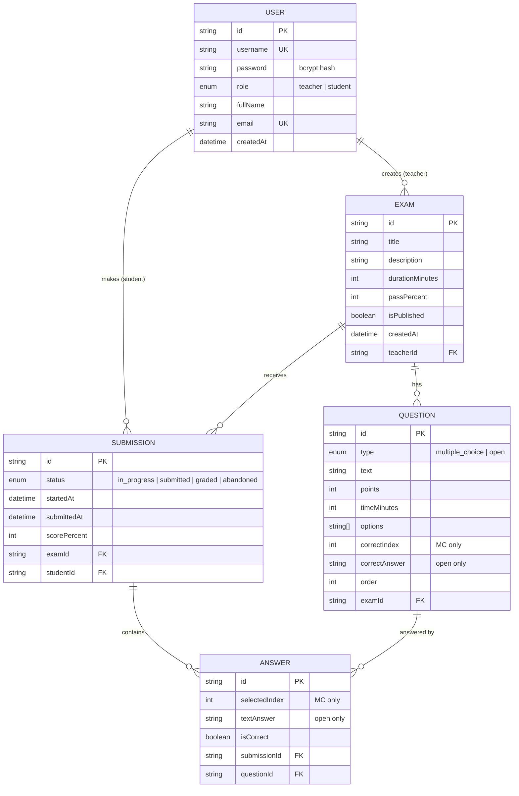

# Database design

PostgreSQL, modelled with Prisma (`server/prisma/schema.prisma`).

## ERD



## Relationships

- A **User** with role `teacher` owns many **Exams**.
- A **User** with role `student` owns many **Submissions**.
- An **Exam** has many **Questions** and receives many **Submissions**.
- A **Submission** contains many **Answers** (one per answered question).
- Deleting an exam cascades to its questions, submissions, and answers.

## JSON model examples

These are the shapes exchanged over the API (server serializes DB rows to these).

### User (public - never includes password)

```json
{
  "id": "user-teacher-1",
  "username": "drsmith",
  "role": "teacher",
  "fullName": "Dr. Smith",
  "email": "dr.smith@school.edu",
  "createdAt": "2026-01-10T08:00:00.000Z"
}
```

### Exam (with questions) - as returned to the owning teacher

```json
{
  "id": "exam-1",
  "title": "JavaScript Basics",
  "description": "Test your knowledge of core JS concepts.",
  "teacherId": "user-teacher-1",
  "durationMinutes": 20,
  "passPercent": 60,
  "isPublished": true,
  "createdAt": "2026-03-01T12:00:00.000Z",
  "questions": [
    {
      "id": "exam-1-q1",
      "examId": "exam-1",
      "type": "multiple_choice",
      "text": "What does `typeof null` evaluate to?",
      "points": 25,
      "timeMinutes": 5,
      "options": ["\"null\"", "\"undefined\"", "\"object\"", "\"number\""],
      "correctIndex": 2
    }
  ]
}
```

> When a **student** fetches the same exam, `correctIndex` / `correctAnswer`
> are removed so answers cannot be read from network traffic.

### Submission (student view)

```json
{
  "id": "sub-1",
  "examId": "exam-1",
  "studentId": "user-student-1",
  "status": "graded",
  "startedAt": "2026-05-01T09:45:00.000Z",
  "submittedAt": "2026-05-01T10:00:00.000Z",
  "scorePercent": 92,
  "exam": { "id": "exam-1", "title": "JavaScript Basics", "passPercent": 60 }
}
```

### Answer

```json
{
  "id": "ans-1",
  "submissionId": "sub-1",
  "questionId": "exam-1-q1",
  "selectedIndex": 2,
  "textAnswer": null,
  "isCorrect": true
}
```

## Seed / demo accounts

`server/prisma/seed.js` loads demo data:

| Username | Password | Role |
|----------|----------|------|
| `drsmith` | `teacher123` | teacher |
| `alex` | `student123` | student |
| `jordan` | `student123` | student |
| `sam` | `student123` | student |
```
