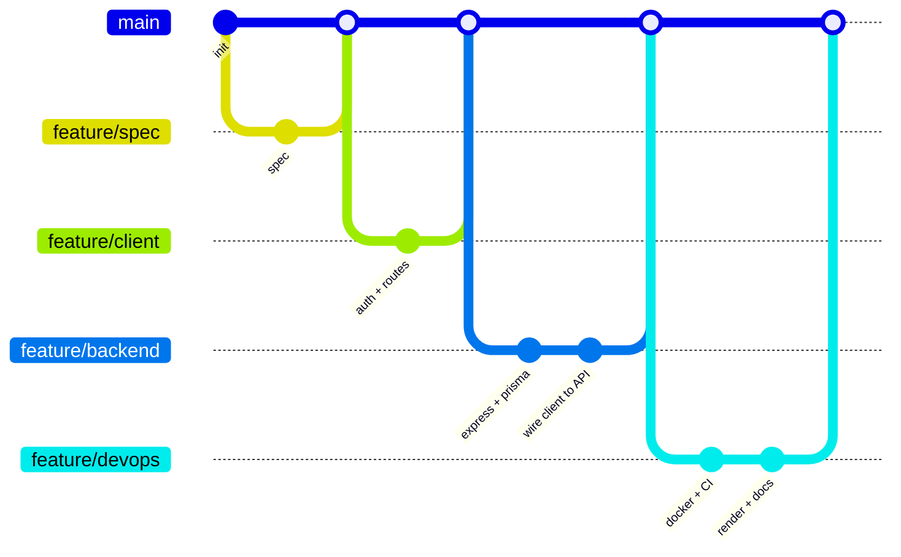

# Milestones, branching & workflows

## Development milestones

The project was built incrementally, each milestone landing via a feature
branch and pull request into `main`.

| # | Milestone | Branch(es) | Outcome |
|---|-----------|-----------|---------|
| 1 | Project spec | `feature/1-specfile` | `spec.txt`, initial repo |
| 2 | Client scaffold + role toggle | `feaure/3-interact` | Vite + React app, Bootstrap, Teacher/Student views |
| 3 | Testing setup | `feature/unittest` | Vitest configured |
| 4 | Mock data layer | `extendMock`, `mockdata` | In-memory DB: users, exams, questions, submissions, answers |
| 5 | Auth flow (client) | `client` | Login/Register, `AuthContext`, protected routes |
| 6 | Teacher exam management | `teacher` | `ExamEditor`, question types, dashboard |
| 7 | Student exam runner | `sudent` | `ExamSession` with per-question timer + grading |
| 8 | **Full backend + DB** | `feature/backend` | Express + Prisma + PostgreSQL, JWT auth, real API |
| 9 | **Client wired to API** | `feature/backend` | Mock DB replaced by HTTP calls; submissions/results pages |
| 10 | **Docker + CI/CD** | `feature/devops` | Dockerfiles, compose, GitHub Actions |
| 11 | **Deployment + docs** | `feature/devops` | Render blueprint, architecture/ERD/UML/sequence docs |

> Milestones 1-7 are the original frontend project (see git history). Milestones
> 8-11 complete the full-stack system.

## Branching strategy



- One branch per feature: `feature/<topic>`.
- Small, focused pull requests merged into `main`.
- Commit style: `feat(scope): ...`, `refactor(scope): ...`, `docs: ...`, `test: ...`.

## Work processes & configuration

### Local development

```bash
# 1. Database (Docker)
docker compose up -d db

# 2. Backend
cd server
cp .env.example .env         # set DATABASE_URL + JWT_SECRET
npm install
npx prisma migrate dev       # create + apply schema
npm run seed                 # load demo data
npm run dev                  # http://localhost:4000

# 3. Frontend
cd ../client
npm install
npm run dev                  # http://localhost:5173
```

### Full stack via Docker Compose

```bash
docker compose up --build
# client    -> http://localhost:8081
# api       -> http://localhost:4000/api
# ai-grader -> http://localhost:4100
# db        -> localhost:5432
```

`SEED_ON_START=true` in `docker-compose.yml` loads demo data on boot.

### Configuration (environment variables)

| Side | Variable | Purpose |
|------|----------|---------|
| server | `DATABASE_URL` | PostgreSQL connection |
| server | `JWT_SECRET`, `JWT_EXPIRES_IN` | Token signing |
| server | `CORS_ORIGIN` | Allowed frontend origin(s) |
| server | `PORT`, `NODE_ENV`, `LOG_LEVEL`, `BCRYPT_ROUNDS` | Runtime tuning |
| client | `VITE_API_BASE` | Backend API URL (baked at build) |

### Unit testing

```bash
cd server && npm test    # Jest: grading, id generators, API smoke tests
cd client && npm test    # Vitest: pure exam/time helpers
```

CI (`.github/workflows/ci.yml`) runs client lint+test+build, server test, and
builds both Docker images on every push/PR.

### Logging

- `winston` application logger (`server/src/utils/logger.js`): pretty/colorized
  in dev, JSON in production, silent in tests.
- `morgan` HTTP access logs piped through winston.
- Central `errorHandler` logs 5xx with stack traces and 4xx as warnings.

### Deployment (Render)

- `render.yaml` provisions PostgreSQL, the Node API (runs `prisma migrate deploy`
  on start), and the static React site.
- Set `CORS_ORIGIN` (API) and `VITE_API_BASE` (web) to the deployed URLs.
```
