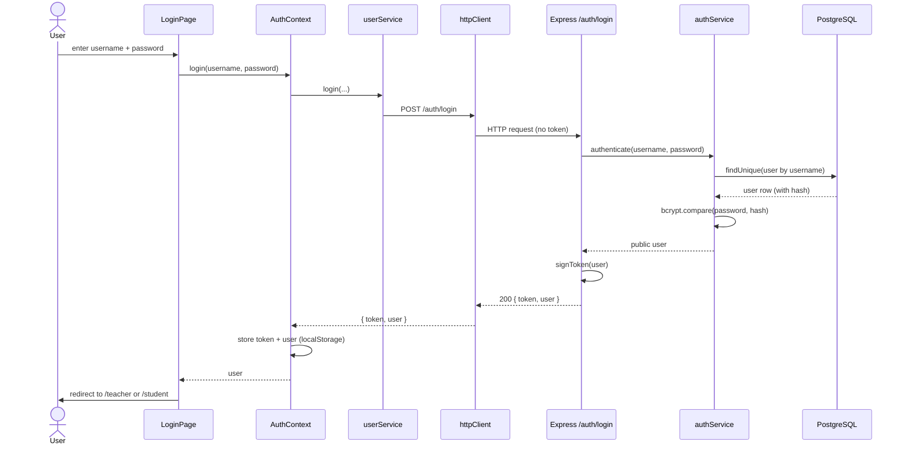
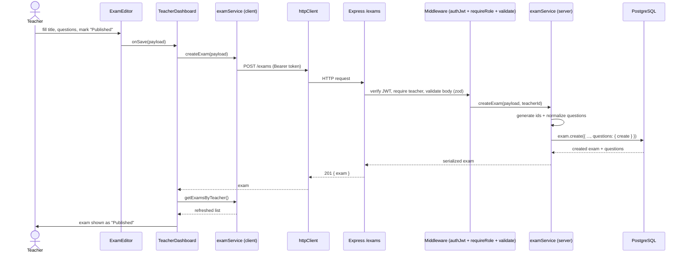
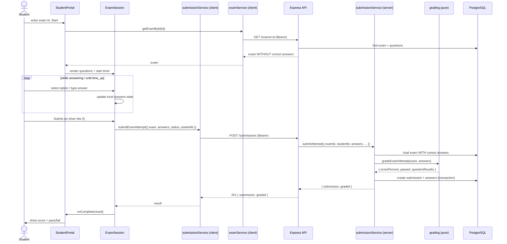
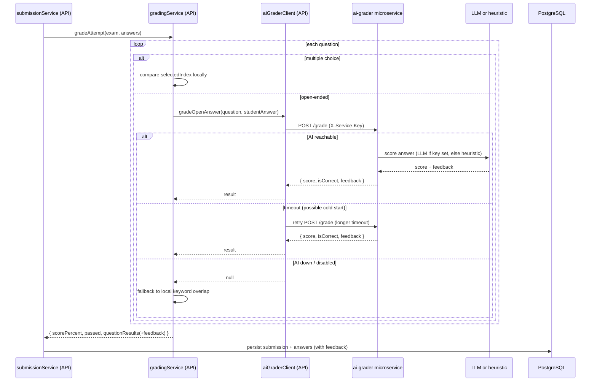

# Sequence diagrams - key scenarios

End-to-end flows showing how data moves across Client, Server, DB, and the AI
grader microservice.

## Scenario 1: Login (student or teacher)

## Scenario 2: Teacher creates and publishes an exam

## Scenario 3: Student takes an exam (auto-graded submission)

## Scenario 4: Grading an open-ended answer via the AI microservice

