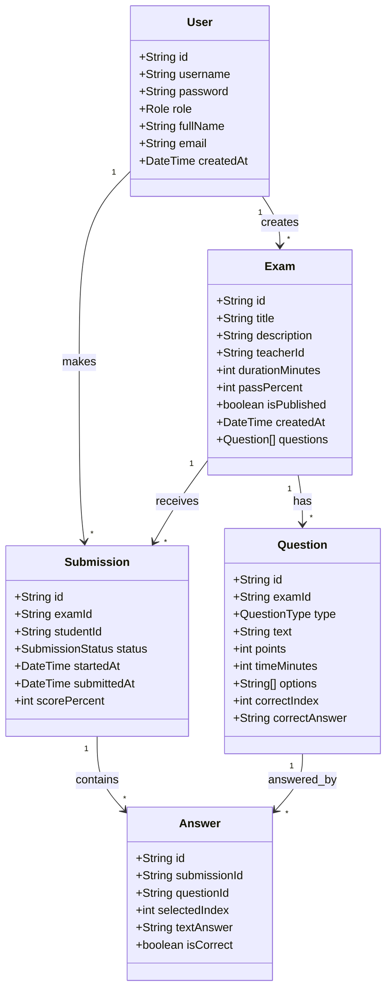
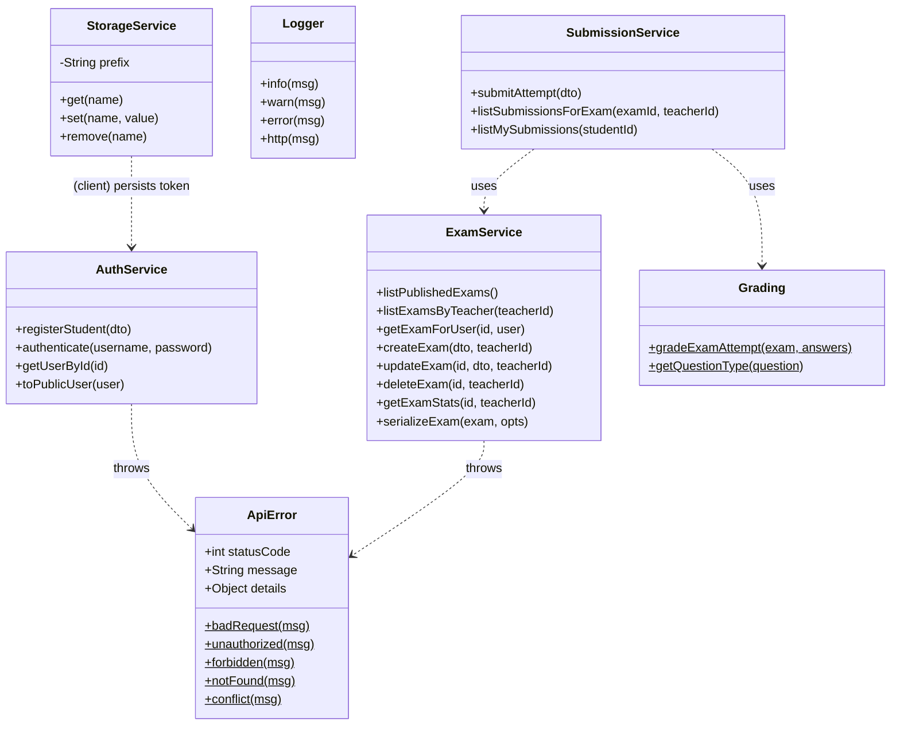

# OOP / Class design (UML)

The codebase is mostly functional, but uses classes and clearly-typed "domain
models" where they add value. This diagram shows the domain entities plus the
service/utility classes.

## Domain model



## Service and utility classes / modules



Notes:
- `StorageService` (client) and `ApiError`/`Logger` (server) are the concrete
  classes. Services are module singletons of pure functions - a pragmatic,
  testable style rather than heavyweight class hierarchies.
- `Grading` is a pure module (no I/O), which is why it is the most heavily
  unit-tested part of the system.
```
